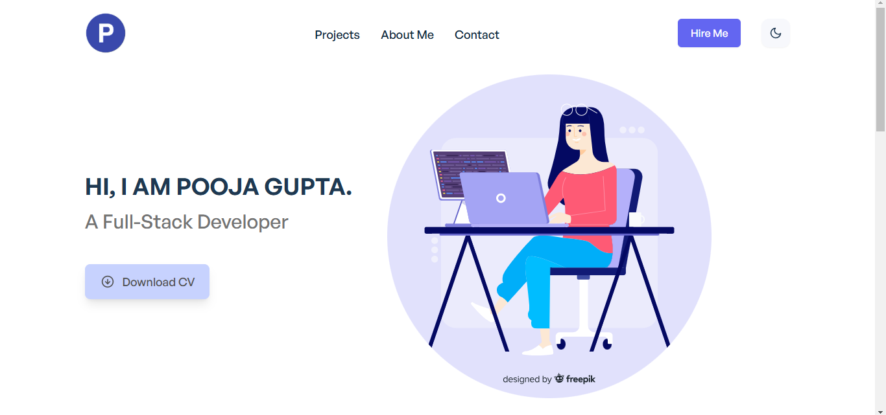
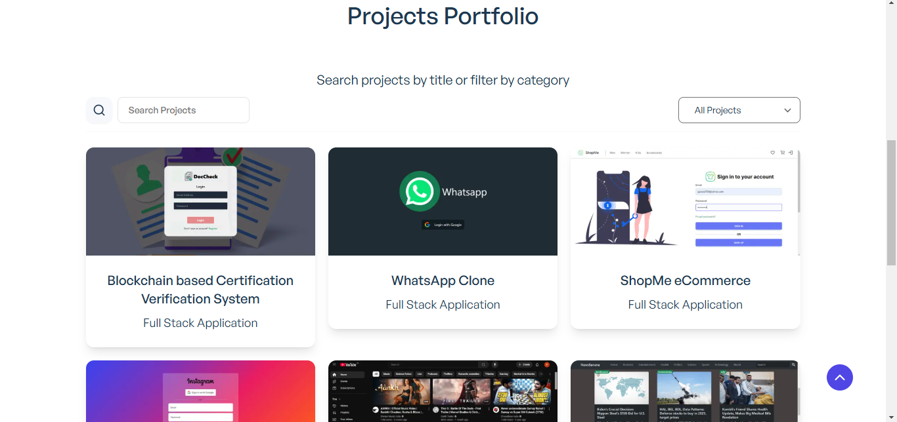

# Next.js, React & TailwindCSS Portfolio Project

A simple portfolio starter theme built with Next.js, React and Tailwind CSS.





## Demo URL

[https://personal-portfolio-git-main-gpooja13s-projects.vercel.app/](https://personal-portfolio-git-main-gpooja13s-projects.vercel.app/)


## Features

-   Built with [Next.js](https://nextjs.org) and [React](https://reactjs.org)
-   [Tailwind CSS v3](https://tailwindcss.com)
-   Custom Hooks
-   Framer Motion Transitions & Animations
-   Reusable Components
-   Projects filter by category
-   Projects filter by search --Still in progress
-   Dark Mode
-   Smooth scroll
-   Counter
-   Dynamic forms
-   Back to top button
-   Download file button
-   Simple and responsive design

## Setup

1. Make sure you have Node JS installed. If you don't have it:

-   [Download it from nodejs.org](https://nodejs.org)

2. Clone the repo:

```
git clone https://github.com/personal-portfolio/nextjs-tailwindcss-portfolio.git
```

3. Open the project folder:

```
cd nextjs-tailwindcss-portfolio
```

4. Install packages and dependencies:

```
npm install
```

5. Start a local dev server at `http://localhost:3000`:

```
npm run dev
```


## Other versions of this project

-   React Version: [https://github.com/realstoman/react-tailwindcss-portfolio](https://github.com/realstoman/react-tailwindcss-portfolio)
-   Vue.js Version: [https://github.com/realstoman/vuejs-tailwindcss-portfolio](https://github.com/realstoman/vuejs-tailwindcss-portfolio)
-   Nuxt.js Version: [https://github.com/realstoman/nuxtjs-tailwindcss-portfolio](https://github.com/realstoman/nuxtjs-tailwindcss-portfolio)


## Notes

-   Always run `npm install` after pulling new changes
-   I'll be constantly updating this repo as I'll be adding more sections to it.
-   Illustrations from [Freepik](https://freepik.com)
-   Contributions are welcome

